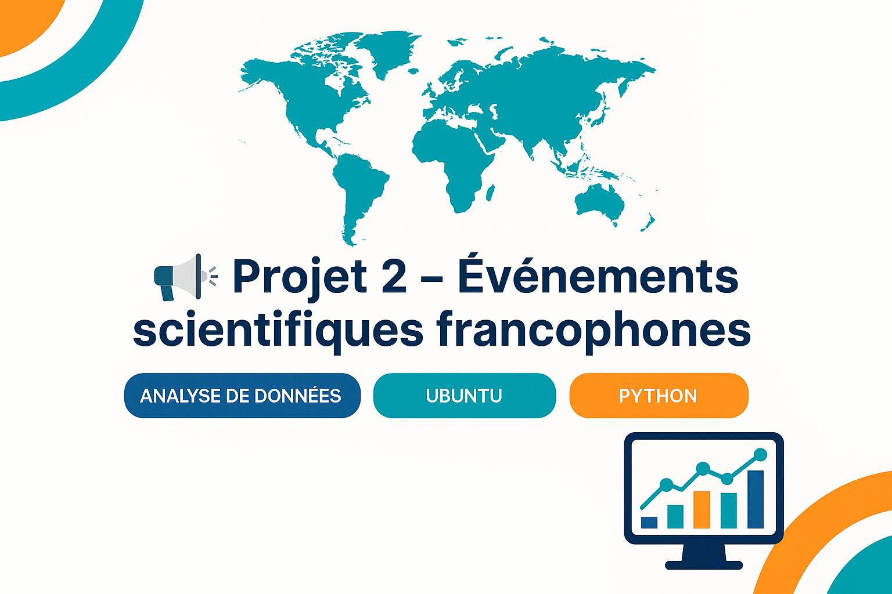

<p align="center">
  
</p>

# 📚 Projet 2 – Événements scientifiques francophones


---

## 🎯 Objectif

Estimer le **nombre d’événements scientifiques francophones** (colloques, conférences, séminaires) à partir des **communications HAL** en français (`docType_s:COMM`, `language_s:fr`).

---

## 🧰 Technologies utilisées

- Python 3.10
- Jupyter Notebook
- Pandas
- Requests
- HAL API
- Git & GitHub

---
## 📁 Structure du projet

```
Projet2_Evenements_Francophones/
├── docs/                                  # README, bannière, visuels
│   └── banner.png                         # Image de présentation (facultative)
├── scripts/                               # Scripts Python
│   └── main.py                            # Script principal d'extraction automatisée
├── evenements_francophones.ipynb          # Notebook d’analyse (Jupyter)
├── nombre_evenements_francophones.csv     # Données extraites depuis HAL
├── rapport_analyse_evenements.md          # Rapport méthodologique (Markdown)
├── requirements.txt                       # Liste des dépendances
└── README.md                              # Documentation principale du projet
```

---

## 🧪 Pipeline de traitement

| Étape | Description |
|:------|:------------|
| 🔹 API HAL | Requête : `language_s:fr AND docType_s:COMM` |
| 🔹 Script Python (`main.py`) | Récupère le total et génère un CSV |
| 🔹 Notebook | Affichage, commentaire et analyse |
| 🔹 Markdown | Rapport final méthodologique |

---

## ⚙️ Lancer le projet

### 1. Cloner le dépôt
```bash
git clone git@github.com:Hicham-Errihani/Projet2_Evenements_Francophones.git
cd Projet2_Evenements_Francophones
